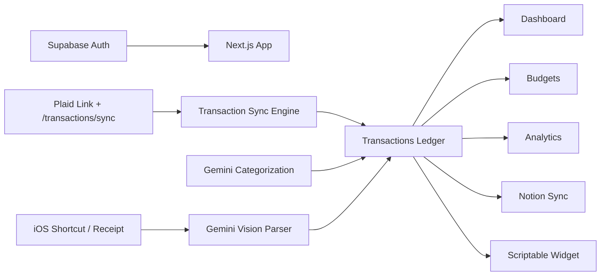

<div align="center">

# Accountant

**A production-grade personal finance cockpit for bank sync, AI-assisted categorization, budgeting, review workflows, iOS capture, and Notion export.**

把银行卡流水、AI 分类、预算口径、复核队列、截图记账和 Notion 同步整合到一个真正可用的个人财务工作台。

[](https://nextjs.org/)
[](https://www.typescriptlang.org/)
[](https://supabase.com/)
[](https://plaid.com/)
[](https://vercel.com/)

**Production:** <https://accountant-rose.vercel.app>

</div>

---

## Why this exists

普通记账 App 最大的问题不是“能不能记一笔”，而是长期维护成本：银行流水要同步、商户名要清洗、退款/转账/信用卡还款要处理、预算不能被 pending 或 split parent 搞脏、复核队列要能真正推动你行动。

Accountant 的目标是做一个**面向真实个人财务工作流**的 cockpit：

- 让 Plaid 自动同步成为数据底座。
- 让 AI 处理重复、脏、模糊的分类工作。
- 让 Dashboard 告诉你“现在该处理什么”。
- 让 Transactions 成为唯一事实工作台。
- 让 Budgets / Analytics 共用同一套严谨交易语义。
- 让 iOS 截图和 Scriptable widget 补足移动端高频入口。

---

## Product surface

| Surface | What it does | Notes |
|---|---|---|
| **Dashboard** | Action-first financial cockpit | 关注待复核、核心指标和最大驱动因素，不是普通卡片堆 |
| **Transactions** | Main ledger workbench | saved views、分类、AI pending、refund、transfer、split、隐藏/删除 |
| **Accounts** | Bank/account management | Plaid item/account 管理，支持 delete-history archive 语义 |
| **Budgets** | Category budget engine | 使用独立 Budget domain 分层，统一 pending/excluded/split 口径 |
| **Analytics** | Review-oriented insights | 解释变化、风险和行动入口，不做无意义图表墙 |
| **iOS Capture** | Screenshot/receipt capture | iOS Shortcut 上传图片，Gemini Vision 解析成交易 |
| **Scriptable Widget** | iPhone home-screen widget | 显示最近交易和后端同步时间 |
| **Notion Sync** | External knowledge/export layer | Supabase -> Notion 单向同步，用户 token 存 profile |
| **Plaid Cron** | Backstop bank sync | Vercel Cron 每日兜底同步 |
| **Notion Outbox Cron** | Async export retry | Vercel Cron 处理 Notion outbox |

---

## Core workflow



Key design choice: **all reporting surfaces must respect the same effective transaction semantics** — deleted/hidden rows, split parents, pending transactions, excluded categories, refunds, transfers, and reimbursements cannot be counted ad hoc by each page.

---

## Architecture at a glance

```text
src/
├── app/                       # Next.js routes, pages, API route handlers
│   ├── (dashboard)/            # dashboard, transactions, accounts, analytics, budgets, settings
│   └── api/                    # Plaid, transactions, budget, Notion, receipt, widget, cron
├── components/                 # shared UI and business components
├── features/dashboard/         # dashboard-specific feature code
├── i18n/                       # shared + route-level translation namespaces
├── lib/
│   ├── transactions/           # effective transaction, saved views, review, split helpers
│   ├── plaid/                  # Plaid client, sync engine, AI classification queue
│   ├── notion/                 # Notion client and sync engine
│   ├── gemini/                 # classification and receipt parser
│   └── supabase/               # browser/server/admin clients
├── modules/
│   ├── budget/                 # Clean Architecture budget domain
│   └── analytics/              # review/insights aggregation
└── types/index.ts              # core domain/data types

supabase/migrations/            # schema, indexes, RLS, RPCs, split functions
```

High-risk domains are intentionally centralized:

- Transaction semantics: `src/lib/transactions/`
- Budget calculations: `src/modules/budget/`
- Plaid sync: `src/lib/plaid/transactions-sync.ts`
- Notion sync: `src/lib/notion/sync.ts`
- Data model: `src/types/index.ts` + `supabase/migrations/`

---

## Tech stack

| Layer | Stack |
|---|---|
| App | Next.js App Router, React, TypeScript |
| UI | Tailwind CSS, Radix UI / shadcn-style primitives |
| Database/Auth | Supabase Postgres + Supabase Auth |
| Bank data | Plaid API |
| AI | Google Gemini for transaction classification and receipt parsing |
| External sync | Notion REST API |
| Mobile entrypoints | iOS Shortcuts, Scriptable |
| Deploy | Vercel + Supabase Cloud |

---

## Getting started

```bash
npm install
cp .env.example .env.local
npm run dev
```

Open <http://localhost:3000>.

Useful checks:

```bash
npm run typecheck
npm run lint
npm run pretest
npm test
npm run build
```

Environment template: [`.env.example`](./.env.example)

Minimum local configuration:

```env
NEXT_PUBLIC_SUPABASE_URL=
NEXT_PUBLIC_SUPABASE_ANON_KEY=
SUPABASE_SERVICE_ROLE_KEY=

PLAID_CLIENT_ID=
PLAID_SECRET=
PLAID_ENV=production
PLAID_WEBHOOK_URL=https://your-domain.com/api/plaid/webhook?secret=...
PLAID_WEBHOOK_SECRET=
CRON_SECRET=

GEMINI_API_KEY=
GEMINI_MODEL=gemini-3.1-flash-lite
```

Notion is configured per user inside `/settings`; the token is stored in `profiles.notion_token`, not hardcoded into the app.

---

## Documentation

| Doc | Purpose |
|---|---|
| [`AI_HANDOFF.md`](./AI_HANDOFF.md) | Agent handoff: current truths, sharp edges, forbidden shortcuts |
| [`docs/ARCHITECTURE.md`](./docs/ARCHITECTURE.md) | Durable architecture, routes, data flows, semantics |
| [`docs/OPERATIONS.md`](./docs/OPERATIONS.md) | Local setup, env vars, deploy, runbook, troubleshooting |
| [`docs/ios-shortcut-guide.md`](./docs/ios-shortcut-guide.md) | iOS Shortcut screenshot/receipt capture setup |
| [`docs/scriptable/README.md`](./docs/scriptable/README.md) | Scriptable recent-transactions widget setup |

---

## Production rules you should not break

- **Do not clear `plaid_items`.** It stores production access tokens and sync cursors.
- **Do not hard-delete account history by default.** Delete-history is archive + transaction soft-delete semantics.
- **Do not rewrite Notion database creation back to the SDK.** The current raw `fetch` path avoids missing-column behavior.
- **Do not count every transaction in reports.** Effective reporting excludes deleted rows, hidden rows, and split parents; budgets also exclude pending and budget-excluded categories.
- **Do not log secrets or user financial data.** Plaid tokens, Supabase service role, Notion tokens, raw `ak_...` keys, cookies, and full transaction dumps stay out of logs/docs.
- **Do not guess Next.js APIs.** This repo uses a newer Next.js version; read local docs before routing/proxy/middleware changes.

---

## Development philosophy

Accountant optimizes for correctness over decorative complexity:

1. One source of truth for transaction semantics.
2. Domain logic outside route handlers when money is involved.
3. Small verified changes over broad rewrites.
4. Product surfaces that answer “what changed, what matters, what should I do next?”
5. Documentation that reflects the current system, not stale implementation plans.
