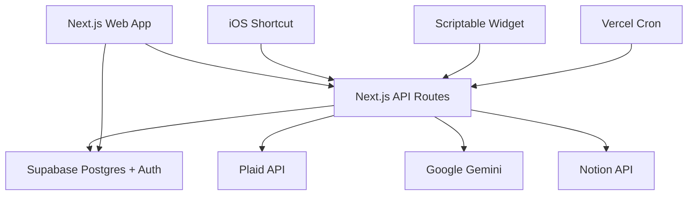
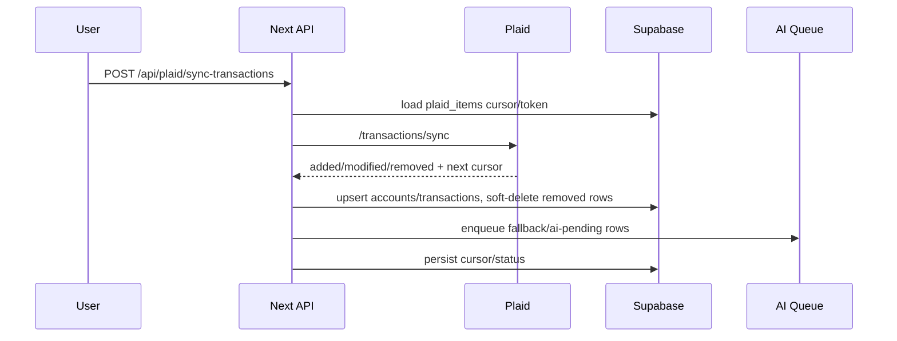

# Architecture — Accountant

本文描述当前仓库的长期架构和核心语义。运行部署看 [`OPERATIONS.md`](./OPERATIONS.md)，Agent 接手看 [`../AI_HANDOFF.md`](../AI_HANDOFF.md)。

## 1. 系统总览

Accountant 是一个 Next.js 单体全栈应用：`src/app` 提供页面和 route handlers，Supabase 负责身份与持久化，Plaid/Gemini/Notion 是外部集成。

## 2. 目录边界

| 路径 | 责任 |
|---|---|
| `src/app/(dashboard)/` | 登录后的页面：dashboard、transactions、accounts、analytics、budgets、settings |
| `src/app/api/` | 后端 route handlers：Plaid、交易、预算、Notion、receipt、widget、cron |
| `src/components/` | 共享 UI 与业务组件 |
| `src/features/dashboard/` | Dashboard 局部类型/组件 |
| `src/i18n/` | 客户端文案与按路由 namespace 拆分的翻译 |
| `src/lib/transactions/` | 交易语义、有效交易过滤、筛选、复核、split UI helper |
| `src/lib/plaid/` | Plaid client、同步、分类队列、fallback 分类 |
| `src/lib/notion/` | Notion client 与 Supabase -> Notion 同步 |
| `src/lib/gemini/` | Gemini 分类与 receipt parser |
| `src/lib/supabase/` | browser/server/admin Supabase clients |
| `src/modules/budget/` | Budget 领域模块，使用 Clean Architecture 分层 |
| `src/modules/analytics/` | Analytics/review 数据聚合与类型 |
| `src/types/index.ts` | 手写核心数据模型类型，理解 schema 的最快入口 |
| `supabase/migrations/` | 数据库 schema、索引、RLS、RPC、迁移历史 |

## 3. 主要页面

| 页面 | 责任 |
|---|---|
| `/dashboard` | 行动优先首页：概览、待处理、最大影响项 |
| `/transactions` | 核心交易工作台：筛选、saved views、复核、分类、split、refund、transfer |
| `/accounts` | Plaid item/account 管理与余额/归档状态 |
| `/analytics` | Review/insights：解释变化、风险和行动入口 |
| `/budgets` | 分类预算与月度预算状态 |
| `/settings` | Notion token、iOS/Widget API key、用户配置 |
| `/auth/login` | 登录/注册 |

## 4. API 路由

### 4.1 Dashboard / Analytics / Budget

| Route | 责任 |
|---|---|
| `GET /api/dashboard` | Dashboard 聚合数据 |
| `GET /api/analytics` | Analytics/review 数据 |
| `GET /api/budget/monthly-summary` | 月度预算汇总 |
| `GET/POST /api/budget/category-budget` | 分类预算读取/保存 |
| `GET /api/categories` | 分类列表 |

### 4.2 Transactions

| Route | 责任 |
|---|---|
| `GET /api/transactions` | 交易列表、筛选、分页、可选 metadata |
| `GET /api/transactions/view-counts` | saved-view count 汇总，使用 RPC 优化 |
| `PATCH /api/transactions/[id]/category` | 修改分类/可批量应用同名交易 |
| `PATCH /api/transactions/[id]/refund` | 退款/reimbursement 链接与复核 |
| `PATCH /api/transactions/[id]/semantics` | treatment/transfer/excluded 等语义修改 |
| `GET/PUT/DELETE /api/transactions/[id]/split` | split 读取、替换、恢复/删除 |
| `POST /api/transactions/[id]/split/preview` | split 预览 |

### 4.3 Plaid

| Route | 责任 |
|---|---|
| `POST /api/plaid/create-link-token` | 创建 Plaid Link token |
| `POST /api/plaid/exchange-token` | public token -> access token，保存 item/accounts |
| `POST /api/plaid/sync-transactions` | 手动增量同步 |
| `POST /api/plaid/webhook` | Plaid webhook，触发同步或状态更新 |
| `GET /api/plaid/accounts` | 当前用户账户列表 |
| `GET/PATCH/DELETE /api/plaid/items/[id]` | Plaid item 管理、断开/删除历史 |
| `GET /api/plaid/items/[id]/accounts` | 某 item 下账户 |
| `GET/POST /api/plaid/ai-classification-jobs` | AI 分类任务 |
| `POST /api/plaid/ai-classification-jobs/process` | 处理 AI 分类队列 |

### 4.4 Integrations

| Route | 责任 |
|---|---|
| `POST /api/receipt` | iOS 图片/收据入账 |
| `GET/POST/DELETE /api/settings/api-keys` | `ak_...` API key 管理 |
| `GET/POST /api/settings/notion` | Notion token 状态/保存 |
| `POST /api/notion/sync` | 手动 Notion force sync |
| `GET /api/widget/recent-transactions` | Scriptable 最近交易 widget |
| `GET /api/cron/plaid-sync` | Vercel Plaid 兜底同步 |
| `GET /api/cron/notion-outbox` | Vercel Notion outbox 处理 |

## 5. 核心数据模型

核心类型定义在 `src/types/index.ts`。数据库真实结构以 `supabase/migrations/` 为准。

| 表 | 说明 |
|---|---|
| `profiles` | 用户配置，含 Notion token/database id |
| `plaid_items` | Plaid institution connection，含 access token、item id、cursor、状态 |
| `accounts` | 银行子账户/手动账户/iOS Capture 账户，含 archive metadata |
| `categories` | 用户分类，含 type、icon、color、budget exclusion |
| `transactions` | 核心流水，含 Plaid/receipt/manual/split 来源、treatment、refund/transfer/split/delete/report 字段 |
| `budgets` | 分类预算 |
| `receipts` | receipt parser 状态、idempotency key、解析结果 |
| `api_keys` | iOS/Widget API key hash、prefix、revocation |
| `ai_classification_jobs` | Gemini 分类批处理任务 |
| `ai_classification_job_items` | 分类任务明细 |
| `transaction_split_groups` | split group 状态和金额快照 |
| `transaction_split_events` | split 审计事件 |
| `notion_sync_outbox` | Notion 异步同步队列 |

## 6. 交易语义

交易报表不能只按金额正负判断。

### 6.1 有效交易

`src/lib/transactions/effective.ts` 定义有效交易：

- `deleted_at IS NULL`
- `is_hidden_from_reports !== true`
- `split_role !== 'parent'`

Split parent 保留原始交易/对账意义，但报表通常看 split children。

### 6.2 Budget 语义

Budget 额外排除：

- `pending = true`
- category 标记 `is_excluded_from_budget = true`
- treatment 为 `transfer` 或 `excluded`

日期优先级：`effective_date` -> `budget_effective_date` -> `date`。

### 6.3 Treatment

当前 treatment 类型：

- `spending`
- `income`
- `refund`
- `transfer`
- `excluded`

退款和 reimbursement 还会看 `refund_source`、`linked_transaction_id`、`refund_match_*`。转账会看 `transfer_group_id`、`transfer_match_status`、`transfer_match_*`。

## 7. 主要数据流

### 7.1 Plaid 交易同步

Webhook 和 cron 进入同一套同步/状态更新路径，避免手动与自动逻辑分叉。

### 7.2 AI 分类

- Plaid 入库先做 fallback 分类并打 tag。
- `classification:ai-pending` / `classification:plaid-fallback` 驱动 saved view 和 count。
- AI 分类任务按 batch/rate limit 处理，成功后更新商户名、分类、tags。

### 7.3 iOS Capture

- iOS Shortcut POST 图片到 `/api/receipt`。
- API 用 `ak_...` key hash 验证用户。
- Gemini Vision 提取金额、商户、日期、币种、支付方式、交易类型。
- 系统创建/复用 `accounts.name = 'iOS Capture'` 的手动账户。
- 交易写入 `transactions`，receipt 状态写入 `receipts`。
- 如果开启 Notion Sync，尝试推送；失败不应回滚交易创建。

### 7.4 Notion Sync

- 单向：Supabase -> Notion。
- `transactions.notion_page_id` 为空则创建页面，否则更新页面。
- Split/异步场景可进入 `notion_sync_outbox`。
- 创建 Notion database 时必须使用原生 `fetch`，不要改回 SDK。

## 8. Security model

- Supabase Auth 管用户身份。
- 浏览器端使用 anon key + RLS。
- 服务端敏感操作使用 service role，但 route handler 必须先确认用户权限。
- API key 只存 hash；raw `ak_...` 只显示一次。
- Plaid access token、Supabase service role、Notion token 不得进日志、文档或客户端 payload。

## 9. 性能热点

当前已知热点/敏感点：

- `src/app/(dashboard)/transactions/page.tsx` 状态与渲染复杂。
- 交易列表 count 使用 `get_transaction_list_counts(...)` RPC 避免多次 exact count。
- `transactions.tags` 有 GIN index，因为 saved views 使用 tag containment。
- 点击才需要的 Plaid/split UI 应保持 lazy load。
- Dashboard 不应加载完整 analytics 或整月交易后在客户端重复 reduce。

## 10. 修改建议

- 修改 Budget：先写/看 engine/service tests，再改 `src/modules/budget/`，不要在 API route 里补 SQL。
- 修改 Transactions：先确认 saved view、effective transaction、split/refund/transfer 副作用。
- 修改 Plaid：先确认 production token/cursor/archive/delete-history 语义。
- 修改 Notion：保留 fetch workaround 和 outbox 语义。
- 修改 Auth/Next：先读本地 Next docs，验证 route protection。
