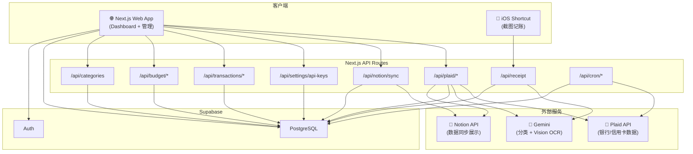

# 系统架构 — Accountant

> 本文记录系统架构、数据库 Schema 和 API 设计。

---

## 架构总览

---

## 数据库 Schema

> 最快了解数据模型的方式：阅读 [`src/types/index.ts`](../src/types/index.ts)。

### `profiles` — 用户配置（对应 `auth.users`）

| 列名 | 类型 | 说明 |
|---|---|---|
| `id` | uuid (PK) | 等于 `auth.users.id` |
| `display_name` | text | 显示名 |
| `default_currency` | text | 默认 'USD' |
| `notion_sync_enabled` | boolean | 是否开启 Notion 同步 |
| `notion_token` | text | Notion Integration Token（敏感字段；客户端不可直接读取，Settings 通过 server route 保存/显示 masked 状态） |
| `notion_database_id` | text | 系统自动写入（首次同步时创建数据库后回写） |
| `created_at` | timestamptz | |
| `updated_at` | timestamptz | |

### `plaid_items` — 已连接的银行机构

| 列名 | 类型 | 说明 |
|---|---|---|
| `id` | uuid (PK) | |
| `user_id` | uuid (FK → auth.users) | |
| `access_token` | text | Plaid access_token（⚠️ 生产环境真实密钥） |
| `item_id` | text | Plaid item ID |
| `institution_name` | text | 银行名称（如 "US Bank"） |
| `institution_id` | text | Plaid 机构 ID |
| `cursor` | text | `/transactions/sync` 增量游标 |
| `status` | text | 'active' / 'error' / 'login_required' |
| `error_code` | text | Plaid 错误代码 |
| `last_synced_at` | timestamptz | 最后成功同步时间 |
| `last_sync_error` | text | 同步失败信息 |
| `created_at` | timestamptz | |
| `updated_at` | timestamptz | |

### `accounts` — 银行子账户缓存

| 列名 | 类型 | 说明 |
|---|---|---|
| `id` | uuid (PK) | 内部 ID |
| `user_id` | uuid (FK) | |
| `plaid_item_id` | uuid (FK → plaid_items) | 注意：代码里是 `plaid_item_id`，不是 `item_id` |
| `plaid_account_id` | text | Plaid 的 account_id |
| `name` | text | 账户名（iOS Capture 账户名为 `'iOS Capture'`） |
| `official_name` | text | 官方全称 |
| `mask` | text | 卡号后 4 位 |
| `current_balance` | numeric | 当前余额 |
| `available_balance` | numeric | 可用余额 |
| `iso_currency_code` | text | 默认 'USD' |
| `type` | text | 'checking' / 'savings' / 'credit' / 'cash' / 'investment' / 'other' |
| `subtype` | text | 账户子类型 |
| `is_manual` | boolean | 是否手动账户 |
| `created_at` | timestamptz | |
| `updated_at` | timestamptz | |

### `transactions` — 交易记录（核心）

| 列名 | 类型 | 说明 |
|---|---|---|
| `id` | uuid (PK) | |
| `user_id` | uuid (FK) | |
| `account_id` | uuid (FK → accounts) | |
| `category_id` | uuid (FK → categories) | |
| `plaid_transaction_id` | text (unique) | Plaid 交易 ID，手动记录为 null |
| `amount` | numeric | **⚠️ Plaid 约定：正数=支出，负数=收入** |
| `iso_currency_code` | text | |
| `date` | date | |
| `authorized_date` | date | |
| `merchant_name` | text | |
| `description` | text | 商户名/描述 |
| `payment_channel` | text | 'online' / 'in store' / 'other' |
| `pending` | boolean | |
| `source` | text | 'plaid' / 'manual' / 'receipt' |
| `receipt_url` | text | 上传的小票图片链接 |
| `notion_page_id` | text | 已同步到 Notion 的 page ID（用于增量判断） |
| `tags` | text[] | |
| `notes` | text | |
| `created_at` | timestamptz | |
| `updated_at` | timestamptz | |

分类相关系统标签：

| Tag | 说明 |
|---|---|
| `classification:ai` | 分类由 Gemini AI 确认 |
| `classification:plaid-fallback` | AI 未完成时使用 Plaid 分类兜底 |
| `classification:ai-pending` | 需要进入 AI 分类队列刷新 |

### `categories` — 分类

| 列名 | 类型 | 说明 |
|---|---|---|
| `id` | uuid (PK) | |
| `user_id` | uuid (FK) | |
| `name` | text | 英文分类名 |
| `name_zh` | text | 中文显示名 |
| `icon` | text | Emoji 图标 |
| `color` | text | UI 色值 |
| `plaid_primary` | text | Plaid primary 分类映射 |
| `plaid_detailed` | text | Plaid detailed 分类映射 |
| `type` | text | income/expense/transfer |
| `is_excluded_from_budget`| boolean | 是否排除在预算外（如内部转账等）|
| `sort_order` | integer | UI 排序 |
| `created_at` | timestamptz | |

### `budgets` — 预算

| 列名 | 类型 | 说明 |
|---|---|---|
| `id` | uuid (PK) | |
| `user_id` | uuid (FK) | |
| `category_id` | uuid (FK → categories) | |
| `amount` | numeric | 预算金额 |
| `period` | text | weekly/monthly/yearly |
| `month` | integer | 月度预算月份 |
| `year` | integer | 年份 |
| `alert_threshold` | numeric | 预警阈值，默认 0.80 |
| `created_at` | timestamptz | |
| `updated_at` | timestamptz | |

### `ai_classification_jobs` — Plaid AI 分类任务

> 依赖 `supabase/migrations/003_ai_classification_queue.sql`。

| 列名 | 类型 | 说明 |
|---|---|---|
| `id` | uuid (PK) | |
| `user_id` | uuid (FK) | |
| `status` | text | queued/running/completed/failed/canceled |
| `total_count` | integer | 本次待处理总数 |
| `pending_count` | integer | queued + processing 数量 |
| `completed_count` | integer | 已完成数量 |
| `failed_count` | integer | 失败数量 |
| `error_message` | text | 任务级错误 |
| `completed_at` | timestamptz | 完成时间 |
| `created_at` | timestamptz | |
| `updated_at` | timestamptz | |

### `ai_classification_job_items` — Plaid AI 分类队列项

| 列名 | 类型 | 说明 |
|---|---|---|
| `id` | uuid (PK) | |
| `job_id` | uuid (FK → ai_classification_jobs) | |
| `user_id` | uuid (FK) | |
| `transaction_id` | uuid (FK → transactions) | |
| `status` | text | queued/processing/completed/failed/skipped |
| `attempts` | integer | 尝试次数 |
| `error_message` | text | 单项错误 |
| `completed_at` | timestamptz | 完成时间 |
| `created_at` | timestamptz | |
| `updated_at` | timestamptz | |

### `receipts` — iOS Shortcut 上传记录

> ⚠️ 依赖 `supabase/migrations/002_ios_receipt_api_keys.sql`，远端 Supabase 需执行。

| 列名 | 类型 | 说明 |
|---|---|---|
| `id` | uuid (PK) | |
| `user_id` | uuid (FK) | |
| `parsed_data` | jsonb | Gemini 解析结果 |
| `status` | text | 'pending' / 'parsed' / 'confirmed' / 'error' |
| `image_url` | text | 上传截图的路径或 URL |
| `error_message` | text | 解析错误信息 |
| `transaction_id` | uuid (FK → transactions) | 自动生成交易后回写 |
| `created_at` | timestamptz | |

### `api_keys` — iOS Shortcut API Key

> ⚠️ 依赖 `supabase/migrations/002_ios_receipt_api_keys.sql`，远端 Supabase 需执行。

| 列名 | 类型 | 说明 |
|---|---|---|
| `id` | uuid (PK) | |
| `user_id` | uuid (FK) | |
| `name` | text | 用户可读名称 |
| `key_prefix` | text | UI 展示用前缀 |
| `key_hash` | text | `ak_...` token 的 SHA-256 hash |
| `last_used_at` | timestamptz | API Key 认证成功后更新，用于排查手机请求是否到达服务端 |
| `revoked_at` | timestamptz | 撤销后不再可用 |
| `created_at` | timestamptz | |

---

## API 端点

| 端点 | 方法 | 说明 |
|---|---|---|
| `/api/plaid/create-link-token` | POST | 生成 Plaid Link Token |
| `/api/plaid/exchange-token` | POST | 交换 public_token → access_token，初始化账户 |
| `/api/plaid/sync-transactions` | POST | 增量拉取 Plaid 交易（基于 cursor） |
| `/api/plaid/webhook` | POST | 接收 Plaid 交易/Item webhook，自动触发增量同步或更新 Item 状态 |
| `/api/plaid/accounts` | GET | 获取已连接的 Plaid 账户列表 |
| `/api/plaid/ai-classification-jobs` | GET/POST | 查看最近 AI 分类任务 / 将待刷新 Plaid 交易一次性入队 |
| `/api/plaid/ai-classification-jobs/process` | POST | 按队列批次处理 AI 分类 |
| `/api/cron/plaid-sync` | GET | 定时兜底触发增量交易同步 (Cron) |
| `/api/transactions/[id]/category` | PATCH | 手动修改分类，可选择同步同名交易 |
| `/api/categories` | GET | 获取系统分类列表 |
| `/api/budget/monthly-summary` | GET | 获取月度预算汇总与进度数据 |
| `/api/budget/category-budget` | POST | 创建或更新指定分类的预算金额 |
| `/api/notion/sync` | POST | 触发 Supabase → Notion 增量同步 |
| `/api/receipt` | POST | iOS Shortcut 上传截图，Gemini 解析后写入交易 |
| `/api/settings/api-keys` | GET/POST/DELETE | iOS Shortcut API Key 管理 |

### Plaid 交易分类流程

1. `/api/plaid/sync-transactions` 使用 Plaid `/transactions/sync` 增量拉取交易。
2. 如果交易已有稳定分类，则保留现有分类。
3. 如果 AI 分类未完成，则用 Plaid primary/detailed 映射到本地分类作为兜底，并写入 `classification:plaid-fallback` + `classification:ai-pending`。
4. Transactions 页面可触发 AI Refresh：`/api/plaid/ai-classification-jobs` 将所有待刷新交易入队。
5. `/api/plaid/ai-classification-jobs/process` 每次最多处理 20 笔，调用配置的 Gemini 模型，并受上游模型配额限制保护。
6. AI 成功后写入分类、清洗商户名，并将标签切换为 `classification:ai`。
7. 用户手动点击交易行分类 pill 修改分类时，系统清除自动分类标签；若存在同名交易，页面会询问是否通过 `apply_mode = 'similar'` 批量同步。

### Plaid Webhook 同步流程

1. `PLAID_WEBHOOK_URL` 配置后，新 Plaid Link Token 会携带 webhook URL。
2. 已连接的旧 Item 在下一次手动调用 `/api/plaid/sync-transactions` 时，会通过 Plaid `/item/webhook/update` 补注册同一个 webhook URL。
3. `/api/plaid/webhook` 用 `PLAID_WEBHOOK_SECRET` 校验 `x-plaid-webhook-secret` header；未配置 secret 时 fail closed。
4. 收到 `TRANSACTIONS:SYNC_UPDATES_AVAILABLE`、`DEFAULT_UPDATE` 或 `TRANSACTIONS_REMOVED` 后，按 Plaid `item_id` 查本地 `plaid_items`，再调用 `src/lib/plaid/transactions-sync.ts` 执行 cursor 增量同步。
5. 收到 `ITEM:ERROR` 时会把本地 Plaid Item 标记为 `error` 或 `login_required`；收到 `ITEM:LOGIN_REPAIRED` 时恢复为 `active`。
6. Plaid 交易更新不是刷卡实时流；webhook 表示 Plaid 已有可同步更新，不保证消费发生后立即到达。

### `/api/transactions/[id]/category` 详细

**请求格式**：`application/json`

| 字段 | 类型 | 说明 |
|---|---|---|
| `category_id` | string | 目标分类 ID |
| `apply_mode` | string | `single` 或 `similar`，默认 `single` |

`similar` 模式按当前用户、同一 `source`、标准化后的 `merchant_name || description` 匹配同名交易。

### `/api/receipt` 详细

**请求格式**：`multipart/form-data` 或 JSON（base64 图片）

| 字段 | 类型 | 说明 |
|---|---|---|
| `image` | file | JPEG 图片 |
| `api_key` | string | `ak_...` 格式的 API Key |
| `currency` | string | 可选，如 `USD` / `CNY`（默认自动识别） |
| `notes` | string | 可选备注 |
| `idempotency_key` | string | 可选但推荐；同一用户同一 key 只会处理一次，用于防止 Shortcut/网络重试重复入账 |

**处理流程**：
1. 用 SHA-256 hash 验证 `api_key` → 获取 `user_id`
2. 调用配置的 Gemini Vision 模型解析图片
3. 自动创建/复用 `accounts.name = 'iOS Capture'` 手动账户
4. 写入 `transactions`（`source = 'receipt'`）
5. 如 Settings 已启用 Notion Sync，则自动尝试同步到 Notion，并返回 `notion.status`；Notion 失败不会让已创建交易的接口整体失败
6. 返回解析结果 JSON

---

## Notion 数据库结构

同步到 Notion 的数据库列结构：

| 属性 | 类型 | 内容 |
|---|---|---|
| Name | title | 商户名/描述 |
| Amount | number | 金额 |
| Currency | select | 币种 |
| Date | date | 消费日期 |
| Category | select | 消费分类 |
| Account | select | 账户名 |
| Type | select | income/expense/transfer |
| Payment Channel | select | online/in store |
| Notes | rich_text | 备注 |
| Source | select | plaid/manual/receipt |
| Tags | multi_select | 自定义标签 |
