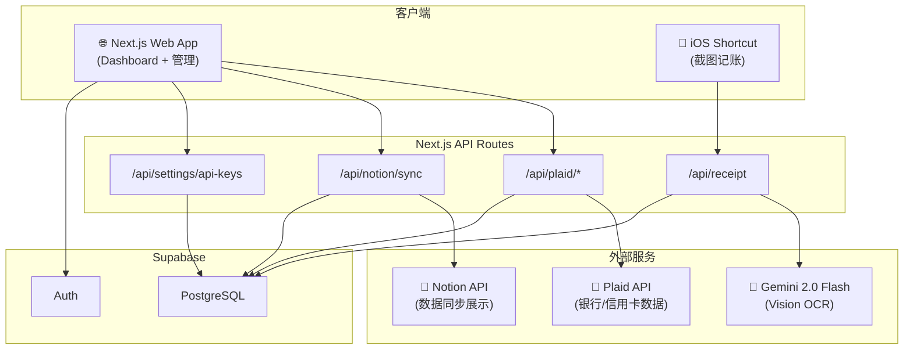

# 系统架构 — Accountant

> 本文记录系统架构、数据库 Schema 和 API 设计。

---

## 架构总览

---

## 数据库 Schema

> 最快了解数据模型的方式：阅读 [`src/types/index.ts`](../src/types/index.ts)。

### `profiles` — 用户配置（对应 `auth.users`）

| 列名 | 类型 | 说明 |
|---|---|---|
| `id` | uuid (PK) | 等于 `auth.users.id` |
| `display_name` | text | 显示名 |
| `default_currency` | text | 默认 'USD' |
| `notion_sync_enabled` | boolean | 是否开启 Notion 同步 |
| `notion_token` | text | Notion Integration Token（用户在 Settings 填写） |
| `notion_database_id` | text | 系统自动写入（首次同步时创建数据库后回写） |

### `plaid_items` — 已连接的银行机构

| 列名 | 类型 | 说明 |
|---|---|---|
| `id` | uuid (PK) | |
| `user_id` | uuid (FK → auth.users) | |
| `access_token` | text | Plaid access_token（⚠️ 生产环境真实密钥） |
| `item_id` | text | Plaid item ID |
| `institution_name` | text | 银行名称（如 "US Bank"） |
| `cursor` | text | `/transactions/sync` 增量游标 |
| `status` | text | 'active' / 'error' / 'login_required' |

### `accounts` — 银行子账户缓存

| 列名 | 类型 | 说明 |
|---|---|---|
| `id` | uuid (PK) | 内部 ID |
| `user_id` | uuid (FK) | |
| `plaid_item_id` | uuid (FK → plaid_items) | 注意：代码里是 `plaid_item_id`，不是 `item_id` |
| `plaid_account_id` | text | Plaid 的 account_id |
| `name` | text | 账户名（iOS Capture 账户名为 `'iOS Capture'`） |
| `mask` | text | 卡号后 4 位 |
| `current_balance` | numeric | 当前余额 |
| `available_balance` | numeric | 可用余额 |
| `iso_currency_code` | text | 默认 'USD' |
| `type` | text | 'checking' / 'savings' / 'credit' 等 |

### `transactions` — 交易记录（核心）

| 列名 | 类型 | 说明 |
|---|---|---|
| `id` | uuid (PK) | |
| `user_id` | uuid (FK) | |
| `account_id` | uuid (FK → accounts) | |
| `plaid_transaction_id` | text (unique) | Plaid 交易 ID，手动记录为 null |
| `amount` | numeric | **⚠️ Plaid 约定：正数=支出，负数=收入** |
| `iso_currency_code` | text | |
| `date` | date | |
| `merchant_name` | text | |
| `description` | text | 商户名/描述 |
| `payment_channel` | text | 'online' / 'in store' / 'other' |
| `pending` | boolean | |
| `source` | text | 'plaid' / 'manual' / 'receipt' |
| `notion_page_id` | text | 已同步到 Notion 的 page ID（用于增量判断） |
| `tags` | text[] | |
| `notes` | text | |

### `receipts` — iOS Shortcut 上传记录

> ⚠️ 依赖 `supabase/migrations/002_ios_receipt_api_keys.sql`，远端 Supabase 需执行。

| 列名 | 类型 | 说明 |
|---|---|---|
| `id` | uuid (PK) | |
| `user_id` | uuid (FK) | |
| `parsed_data` | jsonb | Gemini 解析结果 |
| `status` | text | 'pending' / 'parsed' / 'confirmed' / 'error' |
| `transaction_id` | uuid (FK → transactions) | 自动生成交易后回写 |

### `api_keys` — iOS Shortcut API Key

> ⚠️ 依赖 `supabase/migrations/002_ios_receipt_api_keys.sql`，远端 Supabase 需执行。

| 列名 | 类型 | 说明 |
|---|---|---|
| `id` | uuid (PK) | |
| `user_id` | uuid (FK) | |
| `name` | text | 用户可读名称 |
| `key_prefix` | text | UI 展示用前缀 |
| `key_hash` | text | `ak_...` token 的 SHA-256 hash |
| `last_used_at` | timestamptz | 成功调用 `/api/receipt` 时更新 |
| `revoked_at` | timestamptz | 撤销后不再可用 |

> **仍需实现的表**：`categories`（分类）、`budgets`（预算）——迁移脚本在 `docs/IMPLEMENTATION_PLAN.md` 的 Phase 2 章节可参考。

---

## API 端点

| 端点 | 方法 | 说明 |
|---|---|---|
| `/api/plaid/create-link-token` | POST | 生成 Plaid Link Token |
| `/api/plaid/exchange-token` | POST | 交换 public_token → access_token，初始化账户 |
| `/api/plaid/sync-transactions` | POST | 增量拉取 Plaid 交易（基于 cursor） |
| `/api/notion/sync` | POST | 触发 Supabase → Notion 增量同步 |
| `/api/receipt` | POST | iOS Shortcut 上传截图，Gemini 解析后写入交易 |
| `/api/settings/api-keys` | GET/POST/DELETE | iOS Shortcut API Key 管理 |

### `/api/receipt` 详细

**请求格式**：`multipart/form-data` 或 JSON（base64 图片）

| 字段 | 类型 | 说明 |
|---|---|---|
| `image` | file | JPEG 图片 |
| `api_key` | string | `ak_...` 格式的 API Key |
| `currency` | string | 可选，如 `USD` / `CNY`（默认自动识别） |
| `notes` | string | 可选备注 |

**处理流程**：
1. 用 SHA-256 hash 验证 `api_key` → 获取 `user_id`
2. 调用 Gemini 2.0 Flash Vision API 解析图片
3. 自动创建/复用 `accounts.name = 'iOS Capture'` 手动账户
4. 写入 `transactions`（`source = 'receipt'`）
5. 返回解析结果 JSON

---

## Notion 数据库结构

同步到 Notion 的数据库列结构：

| 属性 | 类型 | 内容 |
|---|---|---|
| Name | title | 商户名/描述 |
| Amount | number | 金额 |
| Currency | select | 币种 |
| Date | date | 消费日期 |
| Category | select | 消费分类 |
| Account | select | 账户名 |
| Type | select | income/expense/transfer |
| Payment Channel | select | online/in store |
| Notes | rich_text | 备注 |
| Source | select | plaid/manual/receipt |
| Tags | multi_select | 自定义标签 |
