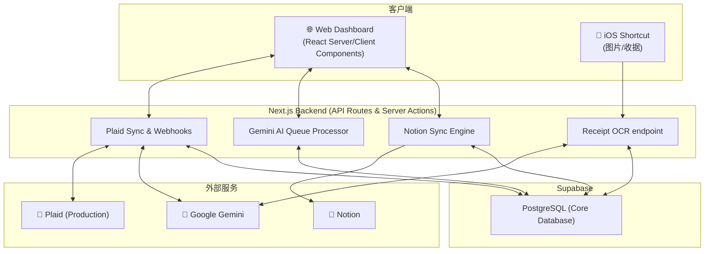

# Accountant - 系统设计与导览文档 (Design & Onboarding Doc)

> **欢迎加入 Accountant 开发！** 🚀
> 这份文档旨在帮助第一次接触该项目的开发者快速建立对 Accountant 系统的全局认知，理解其核心技术选型、系统架构、业务逻辑以及开发中需要注意的“坑”。

---

## 1. 项目概览 (Project Overview)

Accountant 是一个类 Copilot Money 的 **Next.js 全栈个人财务工作台**。它的核心愿景是让记账过程自动化、智能化。

**核心能力：**
- **银行直连**：通过 Plaid API 自动同步银行卡/信用卡的交易流水。
- **AI 智能分类**：利用 Google Gemini 强大的自然语言处理能力，自动清洗杂乱的商户名称并精准分类。
- **快捷记账**：提供 iOS 快捷指令（Shortcut）接口，支持用户随时随地拍照/截图上传收据，Gemini Vision 自动提取金额、商户和消费属性入账。
- **Notion 同步**：支持将结构化后的交易数据单向自动推送至用户的 Notion 数据库，方便二次整理和多维展示。

目前项目已经部署在 Production 环境，核心链路完全可用，当前正处于体验优化与“交易语义化 (Transaction Semantics)”的架构升级阶段。

---

## 2. 核心技术栈 (Tech Stack)

该项目采用现代化的全栈 Web 技术构建：

- **Frontend & API**: Next.js 16 (App Router + Turbopack), React 19
- **语言**: TypeScript (严格模式)
- **UI & 样式**: Tailwind CSS + Radix UI (shadcn/ui 风格), Chart.js
- **Database & Auth**: Supabase (PostgreSQL + Auth SSR)
- **外部集成**: 
  - Plaid SDK (处于 **Production** 环境，非 Sandbox)
  - Google GenAI (`@google/genai` 用于分类与 OCR)
  - Notion API (使用原生 Fetch 绕过部分官方 SDK Bug)

---

## 3. 核心架构与数据流 (Core Architecture & Data Flow)

系统采用单体架构，Next.js 的 `/api` 目录充当了完整的后端角色，Supabase 负责所有数据的持久化与身份验证。

### 3.1 核心数据流

### 3.2 数据库核心 Schema (Supabase)
了解项目最快的方式是查看 [`src/types/index.ts`](file:///Users/maple/Documents/accountant/src/types/index.ts)。核心表包括：
- `plaid_items`: 存放 Plaid 的 Access Token 与同步游标 (Cursor)。
- `accounts`: 银行子账户或手动账户缓存。
- `transactions`: 核心流水表。包含交易金额、商户、来源 (`plaid`/`receipt`/`manual`)、AI 处理状态等。
- `categories`: 用户自定义分类。
- `ai_classification_jobs` / `items`: 用于控制 Gemini 批处理调用频率的队列表。

---

## 4. 关键业务逻辑解析 (Key Business Logic)

### 4.1 Plaid 交易同步与 AI 分类 (Plaid Sync & AI Engine)
这是应用的核心数据引擎。
1. **增量拉取**: 无论是用户手动刷新还是 Plaid Webhook 触发，系统都会调用 `src/lib/plaid/transactions-sync.ts`，基于数据库中记录的 `cursor` 增量拉取交易。
2. **兜底分类**: 刚入库的交易会先使用 Plaid 提供的原始信息映射一个“兜底分类”，并打上 `classification:plaid-fallback` 和 `classification:ai-pending` 的标签。
3. **AI 批处理队列**: 这些交易会被送入 `ai_classification_jobs` 队列。`/api/plaid/ai-classification-jobs/process` 接口会按批次（如 20 条一次）将其发送给 Gemini 模型进行商户名清洗和智能分类，成功后更新标签为 `classification:ai`。

### 4.2 iOS 截图快捷记账 (iOS Receipt Capture)
无需启动 App 即可记账的杀手级功能。
1. **API Key 验证**: 用户在网页生成 API Key（存 Hash），iOS 快捷指令通过 POST `/api/receipt` 附带图片和 Key 发起请求。
2. **Vision 提取**: 后端调用 Gemini Vision 识别账单属性（金额、货币、商户、支付方式）。
3. **入账**: 自动归入 `accounts.name = 'iOS Capture'` 的虚拟账户中，同时触发 Notion 的异步同步。

### 4.3 领域驱动的预算模块 (Budgeting via Clean Architecture)
项目中其余部分采用标准的 MVC/API Route 模式，但 **Budget（预算）模块采用了 Clean Architecture**（整洁架构）：
- **位置**: `src/modules/budget/`
- **结构**: 被严谨地拆分为 `Engine` (纯业务逻辑)、`Adapter` (数据转化)、`Repository` (数据库访问) 和 `Service` (编排层)。
- **注意**: 修改预算逻辑时，切勿在 API 路由中直接写裸 SQL，必须遵循该模块的分层设计。

---

## 5. 项目目录结构导览 (Codebase Tour)

> 项目主要代码全部在 `src/` 和 `supabase/` 目录下。

- **`src/app/`**: Next.js 路由层。
  - `(dashboard)/`: 控制面板前端页面 (`/transactions`, `/analytics` 等)。
  - `api/`: 所有后端端点 (`/api/plaid`, `/api/cron`, `/api/receipt` 等)。
- **`src/components/`**: 业务 UI 组件（如 `accounts/` 连接银行组件, `layout/` 侧边栏）。
- **`src/lib/`**: 核心服务库。
  - `gemini/`: AI 分类器和 OCR 解析器。
  - `plaid/`: 交易同步逻辑与队列管理。
  - `notion/`: Notion 客户端与同步逻辑。
- **`src/modules/`**: 独立领域的业务模块（目前主要是 `budget/`）。
- **`src/types/`**: 全局 TypeScript 类型定义（与数据库表结构强对应）。
- **`supabase/migrations/`**: 包含所有数据库建表与升级的 `.sql` 脚本，这是理解数据模型的根本。
- **`docs/`**: 其他架构文档及实施计划。

---

## 6. 开发接手必读 "坑" (Gotchas & Workarounds)

> ⚠️ **强烈建议阅读 `AI_HANDOFF.md` 了解完整细节，以下为最易踩坑点摘要：**

1. **Plaid 处于 Production 环境**：数据库 `plaid_items` 中存储的是生产环境的真实 `access_token`。**绝对不要**随意清空该表，否则用户需要重新登录银行授权。
2. **Notion SDK 的 Bug**：官方 `@notionhq/client` 在创建数据库时会静默丢失自定义列定义。因此，`src/lib/notion/sync.ts` 中的 `createTransactionDatabase()` 方法**绕过了 SDK**，直接使用了原生 `fetch`。切勿尝试将其改回使用官方 SDK。
3. **Auth 守卫**：Next.js 的 Auth 中间件位于 `src/middleware.ts`。不要去找 `proxy.ts`（那是个历史遗留名）。
4. **交易语义化 (Transaction Semantics) 演进中**：系统正在从基于 Category（分类）的粗放式预算统计，向基于 `transaction_kind` 和 `budget_behavior` 的细粒度交易语义演进（例如区分转账、退款、信用卡还款）。详情可参阅 `docs/accountant_transaction_semantics_plan/`。

---

祝你编码愉快！有了这些上下文，你应该可以轻松驾驭 Accountant 的 codebase 啦。
