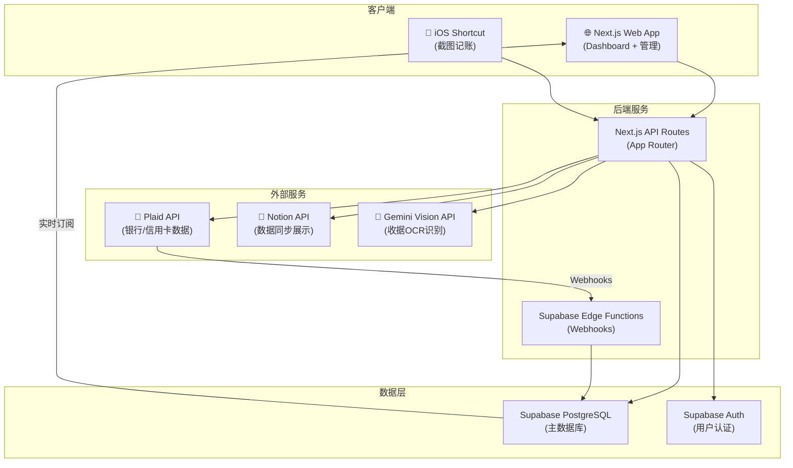
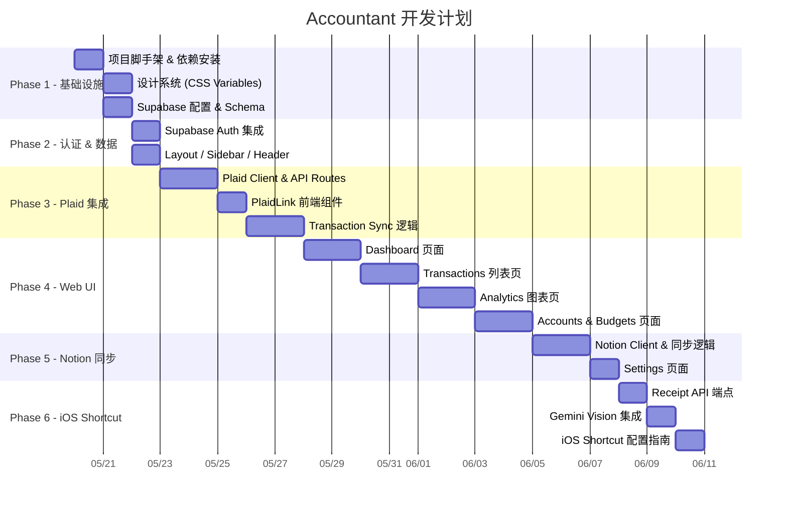

# Accountant — 个人智能记账服务

> 类似 Copilot 记账 App 的个人财务追踪服务，通过 Plaid API 自动拉取信用卡消费，支持截图识别手动记账，并同步至 Notion。

## 系统架构总览



---

## 技术栈选型

| 层级 | 技术 | 理由 |
|---|---|---|
| **前端框架** | Next.js 15 (App Router) | SSR + API Routes 一体化，TypeScript 支持 |
| **UI 样式** | Vanilla CSS + CSS Variables | 自定义深色主题，glassmorphism 效果 |
| **数据库** | Supabase (PostgreSQL) | 关系型，RLS 安全，实时订阅，免费额度充足 |
| **用户认证** | Supabase Auth | 与数据库深度集成，支持 OAuth/Email |
| **银行数据** | Plaid API (Sandbox → Production) | 行业标准金融数据聚合 |
| **数据同步** | Notion API (`@notionhq/client`) | 用户指定的第二 GUI |
| **收据识别** | Gemini 2.0 Flash (Vision) | 高效低成本的多模态 AI |
| **Webhooks** | Supabase Edge Functions (Deno) | 全球分布式，与数据库直连 |
| **部署** | Vercel (Next.js) + Supabase Cloud | 免费额度，零运维 |

---

## User Review Required

> [!IMPORTANT]
> **Plaid 注册**: 你需要在 [dashboard.plaid.com](https://dashboard.plaid.com) 注册一个开发者账号。开发阶段使用免费 Sandbox 环境（假数据），测试凭据为 `user_good` / `pass_good`。Trial Plan 允许连接最多 ~10 个真实账户。

> [!IMPORTANT]
> **Supabase 项目**: 你需要在 [supabase.com](https://supabase.com) 创建一个免费项目，获取 Project URL 和 API Keys。

> [!IMPORTANT]
> **Notion Integration**: 需要在 [notion.so/my-integrations](https://notion.so/my-integrations) 创建一个 Internal Connection，并在 Notion 中将 Integration 添加到目标页面。

## ✅ 已确认的设计决策

| 决策 | 结论 |
|---|---|
| **币种** | 仅 USD ($) 和 RMB (¥)，信用卡全部美元，默认币种 USD |
| **多币种策略** | 金额加货币符号展示，无需汇率换算 |
| **认证** | 启用 Supabase Auth 登录功能 (Email/Password) |
| **部署** | Vercel (Next.js) + Supabase Cloud，备选 DigitalOcean VPS |

---

## Proposed Changes

### Phase 1: 项目脚手架 & 基础设施

#### [NEW] 项目初始化

使用 `create-next-app` 创建 Next.js 15 项目，安装所有依赖：

```bash
npx -y create-next-app@latest ./ --ts --app --src-dir --eslint --no-tailwind --import-alias "@/*"

npm install @supabase/supabase-js @supabase/ssr plaid react-plaid-link @notionhq/client
npm install -D supabase
```

#### [NEW] 项目目录结构

```
accountant/
├── src/
│   ├── app/
│   │   ├── layout.tsx                    # Root layout (字体、全局样式)
│   │   ├── page.tsx                      # Dashboard 首页
│   │   ├── globals.css                   # CSS 变量 & 全局样式
│   │   ├── auth/
│   │   │   ├── login/page.tsx            # 登录页
│   │   │   └── callback/route.ts         # OAuth 回调
│   │   ├── transactions/
│   │   │   └── page.tsx                  # 消费记录列表
│   │   ├── analytics/
│   │   │   └── page.tsx                  # 消费统计 & 图表
│   │   ├── accounts/
│   │   │   └── page.tsx                  # 账户管理
│   │   ├── budgets/
│   │   │   └── page.tsx                  # 预算设置
│   │   ├── settings/
│   │   │   └── page.tsx                  # 设置 (Notion同步、币种等)
│   │   └── api/
│   │       ├── plaid/
│   │       │   ├── create-link-token/route.ts
│   │       │   ├── exchange-token/route.ts
│   │       │   └── sync-transactions/route.ts
│   │       ├── receipt/
│   │       │   └── route.ts              # iOS Shortcut 截图上传端点
│   │       ├── notion/
│   │       │   └── sync/route.ts         # 手动触发 Notion 同步
│   │       └── exchange-rate/
│   │           └── route.ts              # 汇率查询
│   ├── components/
│   │   ├── layout/
│   │   │   ├── Sidebar.tsx               # 侧边导航
│   │   │   └── Header.tsx                # 顶部栏
│   │   ├── dashboard/
│   │   │   ├── SpendingOverview.tsx       # 消费概览卡片
│   │   │   ├── RecentTransactions.tsx     # 最近消费
│   │   │   ├── SpendingChart.tsx          # 消费趋势图
│   │   │   └── BudgetProgress.tsx         # 预算进度
│   │   ├── transactions/
│   │   │   ├── TransactionList.tsx        # 消费列表
│   │   │   ├── TransactionItem.tsx        # 单条消费
│   │   │   └── TransactionFilter.tsx      # 筛选器
│   │   ├── accounts/
│   │   │   ├── AccountCard.tsx            # 账户卡片
│   │   │   └── PlaidLinkButton.tsx        # Plaid 连接按钮
│   │   ├── charts/
│   │   │   ├── CategoryPieChart.tsx       # 分类饼图
│   │   │   ├── TrendLineChart.tsx         # 趋势折线图
│   │   │   └── MonthlyBarChart.tsx        # 月度柱状图
│   │   └── ui/
│   │       ├── Card.tsx
│   │       ├── Button.tsx
│   │       ├── Badge.tsx
│   │       ├── Modal.tsx
│   │       └── CurrencyDisplay.tsx        # 多币种金额展示
│   ├── lib/
│   │   ├── supabase/
│   │   │   ├── client.ts                 # 浏览器端 Supabase client
│   │   │   ├── server.ts                 # 服务端 Supabase client
│   │   │   └── middleware.ts             # Session 刷新
│   │   ├── plaid/
│   │   │   └── client.ts                 # Plaid client 初始化
│   │   ├── notion/
│   │   │   ├── client.ts                 # Notion client
│   │   │   └── sync.ts                   # 同步逻辑
│   │   ├── gemini/
│   │   │   └── receipt-parser.ts          # 收据图片解析
│   │   ├── currency.ts                   # 币种格式化工具
│   │   └── categories.ts                 # PFC 分类映射
│   └── types/
│       ├── database.types.ts             # Supabase 自动生成的类型
│       └── index.ts                      # 自定义类型
├── supabase/
│   ├── config.toml                       # 本地开发配置
│   ├── migrations/
│   │   └── 001_initial_schema.sql        # 初始数据库 Schema
│   ├── seed.sql                          # 测试数据
│   └── functions/
│       └── plaid-webhook/
│           └── index.ts                  # Plaid Webhook 处理
├── public/
│   └── icons/                            # 分类图标
├── .env.local                            # 环境变量 (不提交)
├── .env.example                          # 环境变量模板
├── middleware.ts                         # Next.js 中间件 (Auth session)
└── package.json
```

#### [NEW] [.env.example](file:///Users/maple/Documents/accountant/.env.example)

```env
# Supabase
NEXT_PUBLIC_SUPABASE_URL=your-project-url
NEXT_PUBLIC_SUPABASE_ANON_KEY=your-anon-key
SUPABASE_SERVICE_ROLE_KEY=your-service-role-key

# Plaid
PLAID_CLIENT_ID=your-plaid-client-id
PLAID_SECRET=your-plaid-sandbox-secret
PLAID_ENV=sandbox

# Notion
NOTION_TOKEN=your-notion-integration-token
NOTION_DATABASE_ID=your-notion-database-id

# Gemini (收据识别)
GEMINI_API_KEY=your-gemini-api-key

# Webhooks (开发环境用 ngrok)
PLAID_WEBHOOK_URL=https://your-domain.com/api/webhooks/plaid
```

---

### Phase 2: 数据库 Schema & 认证

#### [NEW] supabase/migrations/001_initial_schema.sql

7 张核心表：

```sql
-- 1. 用户配置表 (扩展 auth.users)
CREATE TABLE profiles (
  id UUID PRIMARY KEY REFERENCES auth.users(id) ON DELETE CASCADE,
  display_name TEXT,
  default_currency TEXT NOT NULL DEFAULT 'USD',
  notion_sync_enabled BOOLEAN DEFAULT false,
  notion_database_id TEXT,
  created_at TIMESTAMPTZ DEFAULT now(),
  updated_at TIMESTAMPTZ DEFAULT now()
);

-- 2. Plaid 连接表 (存储 access_token)
CREATE TABLE plaid_items (
  id UUID PRIMARY KEY DEFAULT gen_random_uuid(),
  user_id UUID REFERENCES auth.users(id) ON DELETE CASCADE NOT NULL,
  access_token TEXT NOT NULL,          -- 加密存储
  item_id TEXT NOT NULL UNIQUE,        -- Plaid Item ID
  institution_name TEXT,
  institution_id TEXT,
  cursor TEXT,                         -- transactions/sync cursor
  status TEXT DEFAULT 'active' CHECK (status IN ('active', 'error', 'login_required')),
  error_code TEXT,
  created_at TIMESTAMPTZ DEFAULT now(),
  updated_at TIMESTAMPTZ DEFAULT now()
);

-- 3. 账户表
CREATE TABLE accounts (
  id UUID PRIMARY KEY DEFAULT gen_random_uuid(),
  user_id UUID REFERENCES auth.users(id) ON DELETE CASCADE NOT NULL,
  plaid_item_id UUID REFERENCES plaid_items(id) ON DELETE CASCADE,
  plaid_account_id TEXT,               -- Plaid 的 account_id
  name TEXT NOT NULL,
  official_name TEXT,
  type TEXT NOT NULL CHECK (type IN ('checking', 'savings', 'credit', 'cash', 'investment', 'other')),
  subtype TEXT,
  mask TEXT,                           -- 卡号后四位
  current_balance NUMERIC(12, 4),
  available_balance NUMERIC(12, 4),
  iso_currency_code TEXT DEFAULT 'USD',
  is_manual BOOLEAN DEFAULT false,     -- 手动添加的账户
  created_at TIMESTAMPTZ DEFAULT now(),
  updated_at TIMESTAMPTZ DEFAULT now()
);

-- 4. 消费分类表
CREATE TABLE categories (
  id UUID PRIMARY KEY DEFAULT gen_random_uuid(),
  user_id UUID REFERENCES auth.users(id) ON DELETE CASCADE NOT NULL,
  name TEXT NOT NULL,
  name_zh TEXT,                        -- 中文名称
  icon TEXT,                           -- emoji 或图标名
  color TEXT,                          -- 16进制颜色
  plaid_primary TEXT,                  -- 映射 Plaid PFC primary
  plaid_detailed TEXT,                 -- 映射 Plaid PFC detailed
  type TEXT NOT NULL DEFAULT 'expense' CHECK (type IN ('income', 'expense', 'transfer')),
  created_at TIMESTAMPTZ DEFAULT now()
);

-- 5. 交易记录表 (核心)
CREATE TABLE transactions (
  id UUID PRIMARY KEY DEFAULT gen_random_uuid(),
  user_id UUID REFERENCES auth.users(id) ON DELETE CASCADE NOT NULL,
  account_id UUID REFERENCES accounts(id) ON DELETE CASCADE NOT NULL,
  category_id UUID REFERENCES categories(id) ON DELETE SET NULL,
  plaid_transaction_id TEXT UNIQUE,    -- Plaid 交易 ID (手动记录为 null)
  amount NUMERIC(12, 4) NOT NULL,
  iso_currency_code TEXT DEFAULT 'USD',
  date DATE NOT NULL,
  authorized_date DATE,
  merchant_name TEXT,
  description TEXT NOT NULL,
  payment_channel TEXT,                -- online / in store / other
  pending BOOLEAN DEFAULT false,
  source TEXT NOT NULL DEFAULT 'plaid' CHECK (source IN ('plaid', 'manual', 'receipt')),
  receipt_url TEXT,                    -- 收据图片 URL
  notion_page_id TEXT,                 -- Notion 同步后的 page ID
  tags TEXT[],                         -- 自定义标签
  notes TEXT,
  created_at TIMESTAMPTZ DEFAULT now(),
  updated_at TIMESTAMPTZ DEFAULT now()
);

-- 6. 预算表
CREATE TABLE budgets (
  id UUID PRIMARY KEY DEFAULT gen_random_uuid(),
  user_id UUID REFERENCES auth.users(id) ON DELETE CASCADE NOT NULL,
  category_id UUID REFERENCES categories(id) ON DELETE CASCADE NOT NULL,
  amount NUMERIC(12, 4) NOT NULL,
  period TEXT NOT NULL DEFAULT 'monthly' CHECK (period IN ('weekly', 'monthly', 'yearly')),
  month INTEGER CHECK (month BETWEEN 1 AND 12),
  year INTEGER,
  alert_threshold NUMERIC(3, 2) DEFAULT 0.80, -- 80% 时提醒
  created_at TIMESTAMPTZ DEFAULT now(),
  updated_at TIMESTAMPTZ DEFAULT now(),
  UNIQUE (user_id, category_id, month, year)
);

-- 7. 收据记录表 (iOS Shortcut 上传)
CREATE TABLE receipts (
  id UUID PRIMARY KEY DEFAULT gen_random_uuid(),
  user_id UUID REFERENCES auth.users(id) ON DELETE CASCADE NOT NULL,
  image_url TEXT NOT NULL,
  parsed_data JSONB,                   -- AI 解析结果
  status TEXT DEFAULT 'pending' CHECK (status IN ('pending', 'parsed', 'confirmed', 'error')),
  transaction_id UUID REFERENCES transactions(id) ON DELETE SET NULL,
  created_at TIMESTAMPTZ DEFAULT now()
);

-- ===== 索引 =====
CREATE INDEX idx_transactions_user_date ON transactions(user_id, date DESC);
CREATE INDEX idx_transactions_account ON transactions(account_id);
CREATE INDEX idx_transactions_category ON transactions(category_id);
CREATE INDEX idx_transactions_plaid_id ON transactions(plaid_transaction_id);
CREATE INDEX idx_accounts_user ON accounts(user_id);
CREATE INDEX idx_plaid_items_user ON plaid_items(user_id);
CREATE INDEX idx_budgets_user_period ON budgets(user_id, year, month);

-- ===== RLS 策略 =====
ALTER TABLE profiles ENABLE ROW LEVEL SECURITY;
ALTER TABLE plaid_items ENABLE ROW LEVEL SECURITY;
ALTER TABLE accounts ENABLE ROW LEVEL SECURITY;
ALTER TABLE categories ENABLE ROW LEVEL SECURITY;
ALTER TABLE transactions ENABLE ROW LEVEL SECURITY;
ALTER TABLE budgets ENABLE ROW LEVEL SECURITY;
ALTER TABLE receipts ENABLE ROW LEVEL SECURITY;

-- 每个表的 CRUD 策略 (用户只能操作自己的数据)
-- profiles
CREATE POLICY "profiles_select" ON profiles FOR SELECT USING ((SELECT auth.uid()) = id);
CREATE POLICY "profiles_insert" ON profiles FOR INSERT WITH CHECK ((SELECT auth.uid()) = id);
CREATE POLICY "profiles_update" ON profiles FOR UPDATE USING ((SELECT auth.uid()) = id);

-- plaid_items
CREATE POLICY "plaid_items_select" ON plaid_items FOR SELECT USING ((SELECT auth.uid()) = user_id);
CREATE POLICY "plaid_items_insert" ON plaid_items FOR INSERT WITH CHECK ((SELECT auth.uid()) = user_id);
CREATE POLICY "plaid_items_update" ON plaid_items FOR UPDATE USING ((SELECT auth.uid()) = user_id);
CREATE POLICY "plaid_items_delete" ON plaid_items FOR DELETE USING ((SELECT auth.uid()) = user_id);

-- accounts (same pattern)
CREATE POLICY "accounts_all" ON accounts FOR ALL USING ((SELECT auth.uid()) = user_id) WITH CHECK ((SELECT auth.uid()) = user_id);

-- categories
CREATE POLICY "categories_all" ON categories FOR ALL USING ((SELECT auth.uid()) = user_id) WITH CHECK ((SELECT auth.uid()) = user_id);

-- transactions
CREATE POLICY "transactions_all" ON transactions FOR ALL USING ((SELECT auth.uid()) = user_id) WITH CHECK ((SELECT auth.uid()) = user_id);

-- budgets
CREATE POLICY "budgets_all" ON budgets FOR ALL USING ((SELECT auth.uid()) = user_id) WITH CHECK ((SELECT auth.uid()) = user_id);

-- receipts
CREATE POLICY "receipts_all" ON receipts FOR ALL USING ((SELECT auth.uid()) = user_id) WITH CHECK ((SELECT auth.uid()) = user_id);
```

---

### Phase 3: Plaid 集成 (银行/信用卡数据)

#### [NEW] [client.ts](file:///Users/maple/Documents/accountant/src/lib/plaid/client.ts)

Plaid client 初始化，封装 `Configuration` + `PlaidApi`。

#### [NEW] [create-link-token/route.ts](file:///Users/maple/Documents/accountant/src/app/api/plaid/create-link-token/route.ts)

- 创建 Link Token，指定 `products: [Transactions]`
- 传入当前认证用户 ID
- 可选配置 webhook URL

#### [NEW] [exchange-token/route.ts](file:///Users/maple/Documents/accountant/src/app/api/plaid/exchange-token/route.ts)

- 接收前端的 `public_token`
- 交换为永久 `access_token`
- 获取账户列表（`/accounts/get`）
- 存入 `plaid_items` 和 `accounts` 表

#### [NEW] [sync-transactions/route.ts](file:///Users/maple/Documents/accountant/src/app/api/plaid/sync-transactions/route.ts)

- 使用 `/transactions/sync` 增量拉取交易
- 处理 `added` / `modified` / `removed` 三个数组
- 自动映射 Plaid PFC 分类到 `categories` 表
- 更新 cursor 到 `plaid_items` 表
- 分页处理（`has_more` 循环）

#### [NEW] [PlaidLinkButton.tsx](file:///Users/maple/Documents/accountant/src/components/accounts/PlaidLinkButton.tsx)

- 使用 `react-plaid-link` 的 `usePlaidLink` hook
- 动态获取 `link_token`
- `onSuccess` 回调自动交换 token + 首次同步

#### [NEW] supabase/functions/plaid-webhook/index.ts

Supabase Edge Function 处理 Plaid Webhooks：
- 验证 `Plaid-Verification` JWT 签名
- 处理 `SYNC_UPDATES_AVAILABLE` → 触发交易同步
- 处理 `ITEM_LOGIN_REQUIRED` → 更新 `plaid_items.status`
- 部署命令：`supabase functions deploy plaid-webhook --no-verify-jwt`

---

### Phase 4: Web UI (Dashboard & 消费管理)

#### 设计系统

深色主题 + Glassmorphism 风格，灵感来自 Copilot Finance App：

```css
/* 核心设计 Token */
:root {
  /* 深色背景 */
  --bg-primary: #0a0a0f;
  --bg-secondary: #12121a;
  --bg-card: rgba(255, 255, 255, 0.04);
  --bg-card-hover: rgba(255, 255, 255, 0.08);

  /* 玻璃拟态 */
  --glass-bg: rgba(255, 255, 255, 0.06);
  --glass-border: rgba(255, 255, 255, 0.08);
  --glass-blur: 20px;

  /* 强调色 */
  --accent-primary: #6c5ce7;
  --accent-green: #00e676;
  --accent-red: #ff5252;
  --accent-orange: #ffab40;
  --accent-blue: #448aff;

  /* 渐变 */
  --gradient-primary: linear-gradient(135deg, #6c5ce7, #a29bfe);
  --gradient-income: linear-gradient(135deg, #00e676, #69f0ae);
  --gradient-expense: linear-gradient(135deg, #ff5252, #ff8a80);

  /* 文字 */
  --text-primary: #f0f0f5;
  --text-secondary: #8888a0;
  --text-muted: #555570;

  /* 字体 */
  --font-display: 'Inter', sans-serif;
  --font-mono: 'JetBrains Mono', monospace;

  /* 动画 */
  --transition-fast: 150ms ease;
  --transition-smooth: 300ms cubic-bezier(0.4, 0, 0.2, 1);
}
```

#### 核心页面

| 页面 | 功能 |
|---|---|
| **Dashboard** (`/`) | 消费概览、本月总支出、预算进度条、最近 5 笔消费、消费趋势迷你图 |
| **Transactions** (`/transactions`) | 全部消费列表，支持按日期/分类/账户/币种筛选，搜索商户名 |
| **Analytics** (`/analytics`) | 分类饼图、月度趋势折线图、日/周/月柱状图、同比环比分析 |
| **Accounts** (`/accounts`) | 已连接账户卡片、余额展示、Plaid Link 连接新账户、手动添加现金账户 |
| **Budgets** (`/budgets`) | 分类预算设置、进度条、超支提醒配置 |
| **Settings** (`/settings`) | Notion 同步开关/配置、默认币种、分类自定义、账单提醒设置 |

#### 图表方案

使用原生 Canvas API + 轻量图表库：
- **推荐方案**: 使用 [Chart.js](https://www.chartjs.org/) (轻量, ~60KB gzipped)
- 饼图、折线图、柱状图均支持
- 支持动画和响应式

---

### Phase 5: Notion 同步

#### [NEW] [client.ts](file:///Users/maple/Documents/accountant/src/lib/notion/client.ts) & [sync.ts](file:///Users/maple/Documents/accountant/src/lib/notion/sync.ts)

**同步策略**：Supabase → Notion（单向推送）

1. **初始化**: 自动在指定 Notion 页面下创建 "Transactions" 数据库
2. **增量同步**: 每次新增/修改交易时，检查 `notion_page_id`：
   - 为空 → 创建新 Notion 页面
   - 已有 → 更新现有页面
3. **去重**: 使用 `transaction.id` 作为唯一标识
4. **限流**: 使用 `async-sema` 控制为 ~3 req/sec

**Notion 数据库结构**：

| 属性 | 类型 | 内容 |
|---|---|---|
| Name | title | 商户名/描述 |
| Amount | number (dollar) | 金额 |
| Currency | select | 币种 |
| Date | date | 消费日期 |
| Category | select | 消费分类 |
| Account | select | 账户名 |
| Type | select | income/expense/transfer |
| Payment Channel | select | online/in store |
| Notes | rich_text | 备注 |
| Source | select | plaid/manual/receipt |
| Tags | multi_select | 自定义标签 |

**触发时机**：
- Plaid 同步新交易后自动推送
- 手动记账（截图/表单）保存后推送
- Settings 页面支持手动触发全量同步

---

### Phase 6: iOS Shortcut + 截图记账

#### [NEW] [receipt/route.ts](file:///Users/maple/Documents/accountant/src/app/api/receipt/route.ts)

API 端点接收 iOS Shortcut 上传的收据图片：

**请求格式**: `POST /api/receipt` (multipart/form-data)
- `image`: JPEG 文件
- `currency`: 币种代码 (可选, 默认 auto-detect)
- `notes`: 备注 (可选)
- `api_key`: 用户的 API Key (用于认证)

**处理流程**:
1. 验证 API Key → 获取 user_id
2. 上传图片到 Supabase Storage
3. 调用 Gemini 2.0 Flash Vision API 解析收据
4. 提取: 商户名、金额、币种、日期、消费项目
5. 自动创建 `transaction` 记录 (source = 'receipt')
6. 返回解析结果 JSON

#### [NEW] [receipt-parser.ts](file:///Users/maple/Documents/accountant/src/lib/gemini/receipt-parser.ts)

Gemini Vision 调用，使用 structured output：

```typescript
const schema = {
  store_name: "string",
  date: "string (YYYY-MM-DD)",
  items: [{ name: "string", quantity: "number", price: "number" }],
  total_amount: "number",
  currency: "string (ISO 4217)",
  confidence_score: "number (0-1)"
};
```

#### iOS Shortcut 工作流

```
1. [Take Photo] 或 [Select Photos] — 拍摄/选择收据
2. [Convert Image] → JPEG
3. [Resize Image] → max 1024px
4. [Choose from Menu] → 选择币种 (USD/TWD/CNY/EUR/Auto-detect)
5. [Ask for Input] → 可选备注
6. [Get Contents of URL] → POST 到 /api/receipt
7. [Get Dictionary Value] → 解析返回的 JSON
8. [Show Result] → 展示识别结果 (商户、金额、分类)
9. [Show Notification] → 确认记账成功
```

> 项目完成后，我会为你创建这个 Shortcut 的详细配置指南。

---

## 开发阶段规划



---

## Verification Plan

### Automated Tests

```bash
# 1. 类型检查
npx tsc --noEmit

# 2. ESLint
npx next lint

# 3. 本地构建验证
npm run build

# 4. Supabase 本地 Schema 验证
supabase db reset    # 重建数据库 + 运行 migrations
supabase db lint     # 检查 SQL 问题

# 5. Plaid Sandbox 端到端测试
# 使用 sandbox/public_token/create 自动化测试连接流程
# 使用 sandbox/item/fire_webhook 测试 webhook 处理
```

### Manual Verification

1. **Plaid 连接测试**: 在 Sandbox 中使用 `user_good/pass_good` 连接测试银行
2. **交易同步测试**: 验证 `/transactions/sync` 正确拉取并存储交易数据
3. **UI 测试**: 逐页检查 Dashboard、Transactions、Analytics、Accounts、Budgets
4. **Notion 同步测试**: 确认交易数据正确推送到 Notion 数据库
5. **Receipt API 测试**: 使用 curl 上传测试收据图片，验证解析结果
6. **iOS Shortcut 测试**: 在 iPhone 上配置 Shortcut，拍照记账端到端测试
7. **多币种测试**: 验证不同币种金额正确显示和存储
